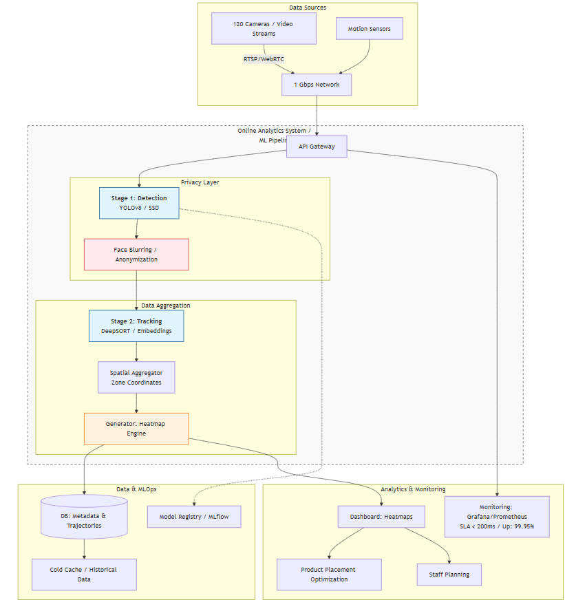
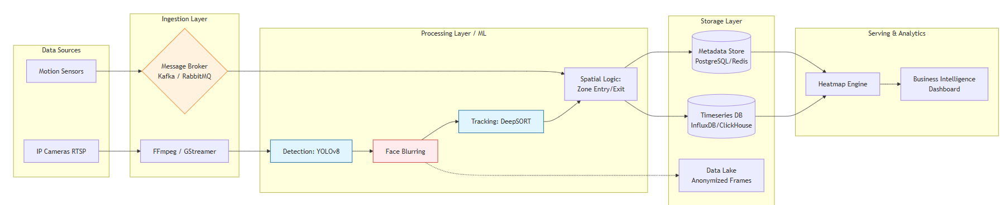
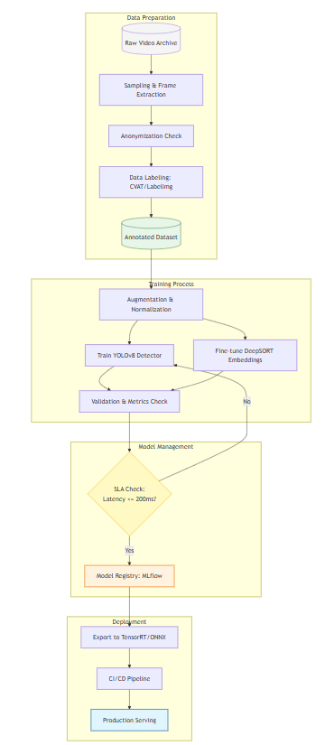
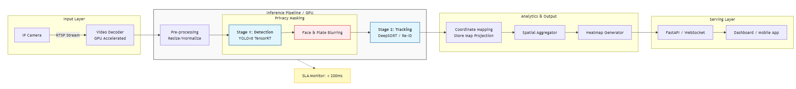

# Домашнее задание: Проектирование ML-системы — Задание 3

**Курс:** Проектирование систем машинного обучения

**Уровень:** 2 курс магистратуры

**Вариант:** 3

**Студент:** Морозов Артем

**Группа:** М8О-209СВ-24

---

## 1. Введение и постановка задачи

В данной работе рассматривается разработка масштабируемой системы для построения **тепловой карты движения покупателей в супермаркете**. Основная задача системы — в режиме реального времени обрабатывать видеопотоки и сенсорные данные для выявления интенсивности посещения зон магазина, при этом обеспечивая конфиденциальность клиентов за счёт размытия лиц и анонимизации данных.

**Бизнес-цели:**
* **Повышение эффективности размещения товаров:** Анализ движения покупателей позволяет оптимизировать расположение товаров и увеличить продажи.  
* **Улучшение планирования персонала:** Определение загруженных зон и времени позволяет эффективнее распределять сотрудников.  
* **Соблюдение конфиденциальности:** Автоматическое размытие лиц и анонимизация данных обеспечивает соблюдение законодательства о защите персональных данных.

**Системные характеристики:**
* **Время отклика:** ≤ 200 мс на обработку видеокадра и построение тепловой карты.  
* **Общее количество камер и сенсоров:** 120 единиц.  
* **Пиковая нагрузка:** 60 видеопотоков одновременно.  
* **Пропускная способность сети:** 1 Гбит/с.  
* **Доступность системы:** 99,95 %.

---

## 2. Формулировка ML-задачи и выбор модели

### 1. Определение ML-задачи

Задача решается как **двухэтапная система обработки видеопотоков**:  

1. **Detection (Обнаружение объектов):** Выделение покупателей на кадрах с помощью детекторов (YOLO, SSD) с применением размытия лиц.  
2. **Tracking & Aggregation (Отслеживание и агрегация):** Отслеживание движения клиентов и построение тепловой карты посещаемости зон магазина.

* **Цель модели:** бинарная классификация/детекция — определение наличия человека на кадре и его позиции на торговой площади.  
* **Данные:** видеопотоки с камер, данные сенсоров движения, метки зон магазина.

---

### 2. Выбор ML-модели

Для реализации ключевого узла системы были рассмотрены два подхода:

1. **Единый детектор с интегрированным трекингом (End-to-End Detector + Tracker)**
   * **Суть:** Модель сразу обрабатывает кадр, детектирует покупателей и строит траектории движения.  
   * **Преимущества:** Высокая точность, единая оптимизация детекции и трекинга.  
   * **Недостатки:** Высокая вычислительная нагрузка; при 60 потоках в реальном времени трудно уложиться в SLA 200 мс; масштабирование при увеличении числа камер затруднено.

2. **Двухступенчатая схема: Detector (YOLOv8/SSD) + Tracker (DeepSORT)**
   * **Суть:**  
     1. **Detector:** Обнаруживает покупателей на кадре и применяет размытие лиц.  
     2. **Tracker:** Отслеживает позиции покупателей между кадрами и агрегирует данные для построения тепловой карты.  
   * **Преимущества:**  
     * **Скорость:** Отдельное детектирование и трекинг позволяют обрабатывать несколько потоков параллельно.  
     * **Эффективность:** Снижение вычислительной нагрузки за счёт использования готовых эмбеддингов объектов.  
     * **Конфиденциальность:** Размытие лиц на этапе детекции гарантирует защиту персональных данных.  

**Обоснование выбора:** Для production-систем с высокой нагрузкой оптимальным является вариант **Detector + Tracker**, так как он обеспечивает баланс между скоростью обработки, точностью отслеживания и соблюдением требований по конфиденциальности. End-to-End детектор слишком ресурсоёмок для работы с множеством потоков одновременно.

---

## 3. Проектирование архитектуры

### 1. Высокоуровневая архитектура системы

### 2. Архитектура Data Pipeline

### 3. Архитектура Training Pipeline

### 4. Архитектура Inference Pipeline (Serving)

---

## Часть 3. Расчёты и нефункциональные требования

### 1. Расчёт требований к хранилищу
* **Видеопотоки и сенсорные данные:** Средний размер кадра с камеры 150 КБ, 120 камер, 60 потоков в пике $\rightarrow$ **~1,3 ГБ/сек**.  
* **Хранение за 24 часа:** 1,3 ГБ/с * 3600 * 24 ≈ **112 ТБ/день**.  
* **С учётом индексов и обработки:** необходимо ~120–130 ТБ в горячем/тёплом хранилище, остальное в холодном архиве.

### 2. Расчёт требований к пропускной способности (Throughput)
* **Пиковая нагрузка:** 60 потоков.  
* **Производительность узла:** Один GPU-инстанс обрабатывает ~4 потока.  
* **Необходимое количество нод:** $60 / 4 = 15$ нод. С учетом отказоустойчивости и резервов $\rightarrow$ **18–20 инстансов**.  
* **Сеть:** 1,3 ГБ/с * 18 нод $\approx$ 23 ГБ/с внутреннего трафика (K8s, Kafka, Redis).

### 3. Масштабируемость и надёжность
* **Горизонтальное масштабирование:** Kubernetes для микросервисов обработки видеопотоков.  
* **Восстановление после сбоев:** Автоматический рестарт контейнеров и репликация потоков.  
* **Конфиденциальность:** Размытие лиц и анонимизация данных на этапе детекции.

---

## Список использованных источников
1. Redmon, J., et al. *YOLO: Real-Time Object Detection*, 2016.  
2. Wojke, N., Bewley, A., & Paulus, D. "Simple Online and Realtime Tracking with a Deep Association Metric", 2017.  
3. Géron, A. *Hands-On Machine Learning with Scikit-Learn, Keras, and TensorFlow*, 2021.  
4. Apache Kafka Documentation. https://kafka.apache.org/  
5. Redis Streams Documentation. https://redis.io/docs/  
6. OpenCV Documentation. https://opencv.org/  
7. Kubeflow: Machine Learning Toolkit for Kubernetes. https://www.kubeflow.org/  
8. Wang, H., et al. "Deep & Cross Network for Real-Time Video Analytics", https://arxiv.org/abs/1708.05123  
